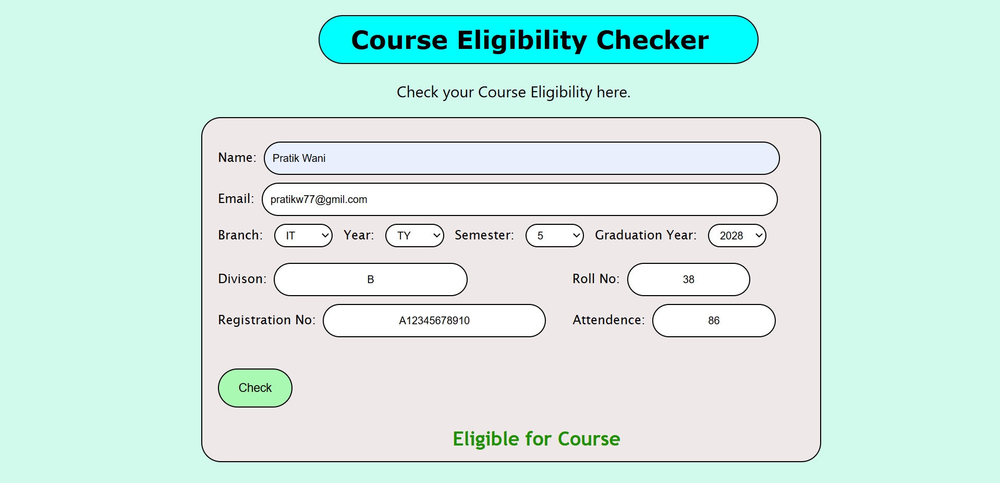
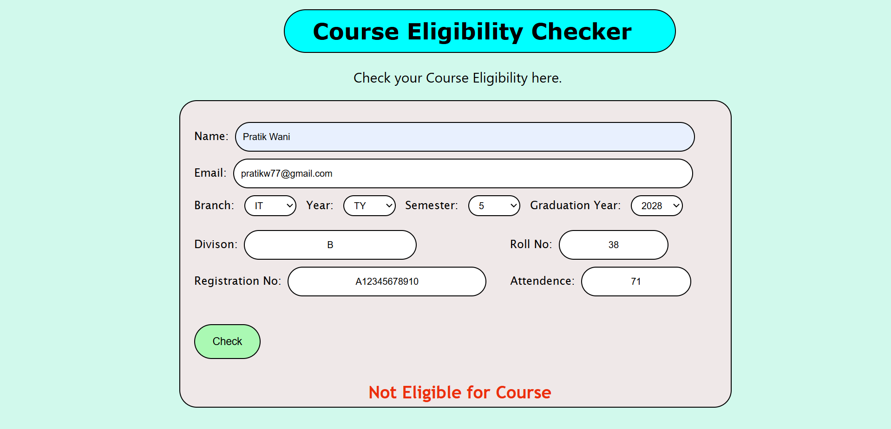

# AWT-B-38
<h2>TAE - 1 Winter 2026 Advanced Web Technology (23UITPCL3508)</h2>
<h4>Problem Statement - Design & Develop Course Eligibilty Checker</h4>

It is a Personalized Course Eligibilty Checker using HTML, CSS, and JavaScript.

 

